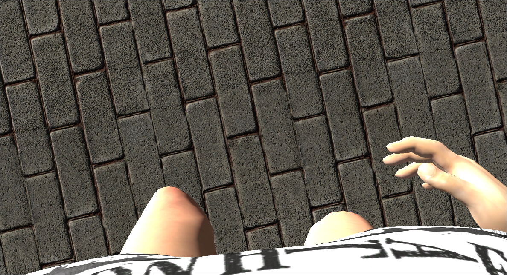

# First person view
This project demonstrates a possible solution for a first person view with an attached animated model. The scene contains a mirror, and the body is visible when the player lowers his head.

I noticed several side effects, however, because I needed to place the camera close to the torso instead of the head to workaround a bad clipping on the body. The consequence is that the proportions of the character are exaggerated compared to the reality, and this distortion may be visible in some circumstances, e.g when the character is close to the mirror.

