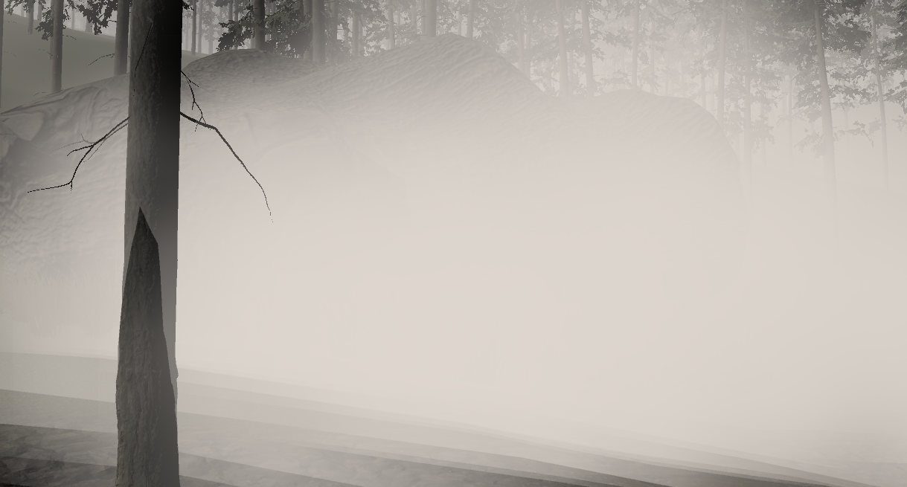

# Unity
This repository contains several demo projects realized with the Unity game engine.

## 1st person view
This project demonstrates a possible solution for a first person view with an attached animated model. The scene contains a mirror, and the body is visible when the player lowers his head.

## 3rd person view
This project demonstrates a possible solution for a third person view.

## Camera behavior
This project is a study about how a 3rd person camera may interact with its environment. There are several options to change the camera position by following a target or the default character body, to apply a dithering on the character when the camera is close to it, and/or to occlude the objects located between the camera and its target. The purpose of this project is to find the best possible balance to allow the camera to follow the player without be hidden by another object.

## Drawing curves
This project contains a small 3D Bezier curve component, which may be added into a scene. I use a such component in several game projects, e.g to show a line of sight towards a target.

## Forest
This project is just an attempt about volumetric fog in a natural ambient.

## Shader tests
These projects are just small laboratories where I test some techniques relatives to shaders and post-processing.

### Bump and parallax mapping
This repository contains a small test about how to create bump mapped and parallax mapped objects.

### Dithering
This repository contains a test around a transparent dither effect I found on the web.

## SQLite Demo
This project demonstrates how Unity may interact with a SQLite database. First a SQLite database may be opened, or created if still not exists, then queries may be processed on the database.

## Survival Demo Scene
This is a small survival horror demo scene, showing how a Resident Evil like may be created with Unity. The demo contains 2 rooms and a door opening interlude. A zombie is also present in a room, with a part of its AI implemented. He can walk to and attack the player.

## License
All the <b>demos</b> and the <b>source code</b> they contain are licensed under the permissive MIT license, unless marked differently in a particular folder/file.

The <b>assets</b> used in the demos are often free assets downloaded from popular stores, <b>please respect and refer to their original license if you download the demo</b>. The download link where you can get them is generally provided in the description of the demo. <b>If you want to use a particular asset for your own projects, please download it from the original store, and use your own copy but never use the asset provided in the demo</b>.
