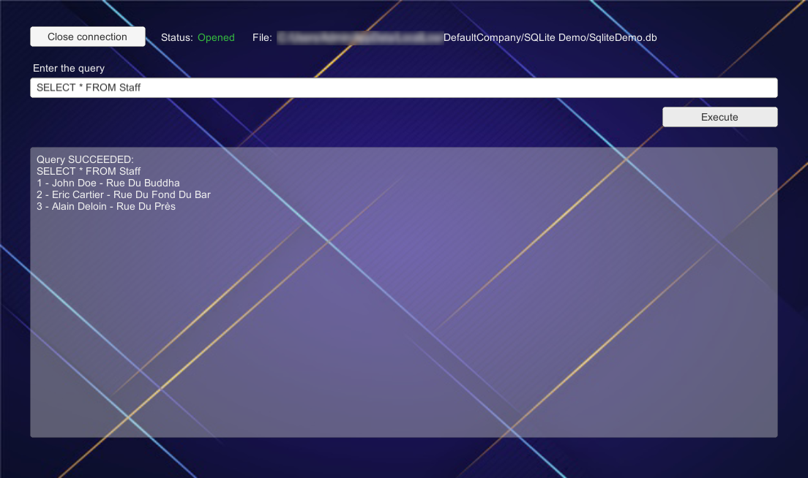

# SQLite Demo
This project demonstrates how Unity may interact with a SQLite database. First a SQLite database may be opened, or created if still not exists, then queries may be processed on the database.

